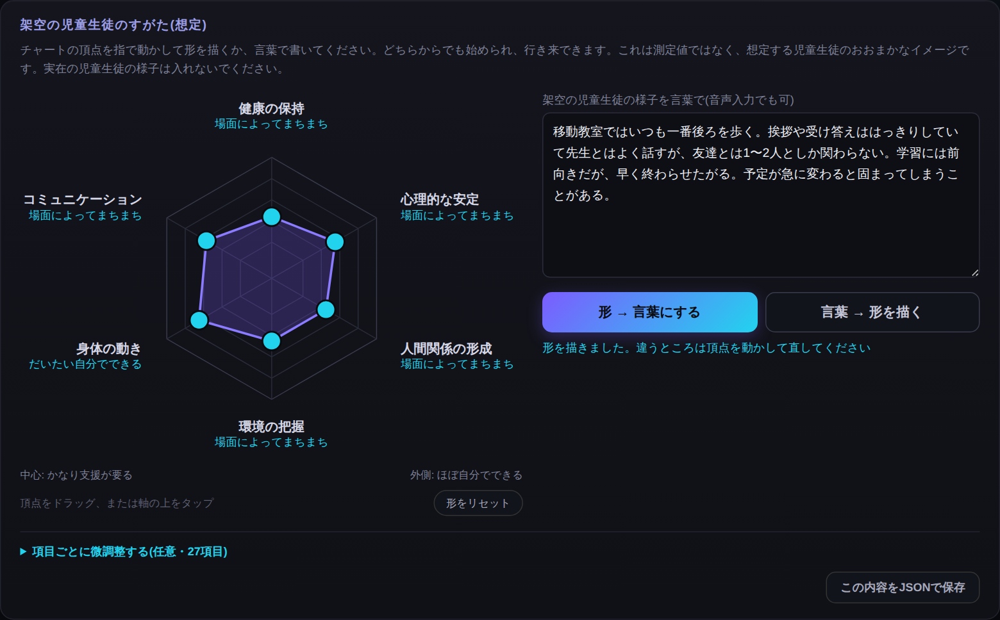

# せんせいアシスト（教育相談編）

**架空の児童生徒**の特性（学年、障害種別、自立活動の6区分27項目の様子など）を入れ、**そのような特性をもつ児童生徒に典型的に考えられる支援**を、AI（Gemini）といっしょに想定する道具です。



- アプリを開く（スライダーとチャートはそのまま使えます）：https://toitoitoi-lab.github.io/sensei-assist/
- AIの機能を使うには、自分の Google アカウントで下の「セットアップ」をしてください。

## つくった理由

「こういう特性の子には、どんな支援が考えられるだろう」。研修や校内の話し合いでは、この問いを短い時間で具体的に考える場面がよくあります。
架空の児童生徒の特性をスライダーと言葉で置き、典型的な支援の例を並べて見ることで、支援の引き出しを増やし、話し合いの材料にするためにつくりました。

## 大切な約束：実際の児童生徒のデータは入れません

- このアプリに入れるのは、**架空の児童生徒の特性だけ**です。
- **実際の児童生徒のデータは入力しないでください。** 氏名や記号に置きかえても、実在の児童生徒の様子をもとにした入力はしないでください。
- 入力した内容は、自分でデプロイした Google Apps Script を通して Gemini API に送られます。
- 出てくるのは、架空の特性から想定した**典型的な支援の例**です。特定の児童生徒の見立てや指導方針として使うものではありません。
- 画面の「架空の例を入れてみる」で、入力の例を試せます。

## しくみ

```
index.html（画面）──POST──▶ Code.gs（Google Apps Script のウェブアプリ）──▶ Gemini API
                                    └──▶ Google ドキュメント（出力を保存するとき）
```

| ファイル | 役割 |
|---|---|
| `index.html` | 画面。27項目のスライダー、レーダーチャート、AIへの相談、JSON保存 |
| `Code.gs` | GAS のバックエンド。Gemini への問い合わせと、Google ドキュメントへの書き出し |

APIキーは `Code.gs` には書かず、GAS の「スクリプト プロパティ」に保存します。

## セットアップ（15分ほど）

1. https://script.google.com で新しいプロジェクトを作り、`コード.gs` の中身を `Code.gs` の内容に置きかえて保存します。
2. https://aistudio.google.com/apikey で Gemini の API キーを作ります。
3. GAS の「プロジェクトの設定」→「スクリプト プロパティ」に、名前 `GEMINI_API_KEY`、値に API キーを入れて保存します。
4. 関数 `authorizeTest` を一度実行し、権限の確認を許可します（ドライブにテスト用ドキュメントができるので、あとで消してかまいません）。
5. 「デプロイ」→「新しいデプロイ」→ 種類「ウェブアプリ」、実行ユーザー「自分」、アクセスできるユーザー「全員」でデプロイし、表示された `…/exec` の URL をコピーします。
6. アプリを開き、下の「GAS WebアプリのURL」に貼りつけます（そのブラウザにだけ保存されます）。

コードを直したときは「デプロイを管理」→ 編集 → 「新バージョン」で同じデプロイを更新してください（新しいデプロイを作ると URL が変わります）。

### 注意

- アクセスを「全員」にすると、**URL を知っている人は誰でもあなたの API 利用枠を使えます**。URL は公開の場に書かないでください。
- モデル名（`GEMINI_MODEL`）は変わることがあります。エラーになったら `gemini-flash-latest` などに書きかえてください。

## 利用について

- コード：MIT ライセンス（`LICENSE` を参照）。自由に使い、改変できます。
- このアプリの考え方や使い方を研修・記事などで紹介するときは、事前にご連絡ください。
  連絡先・利用ルール：https://toitoitoi-lab.github.io/rules/

作成：toi toi toi（https://toitoitoi-lab.github.io/）
